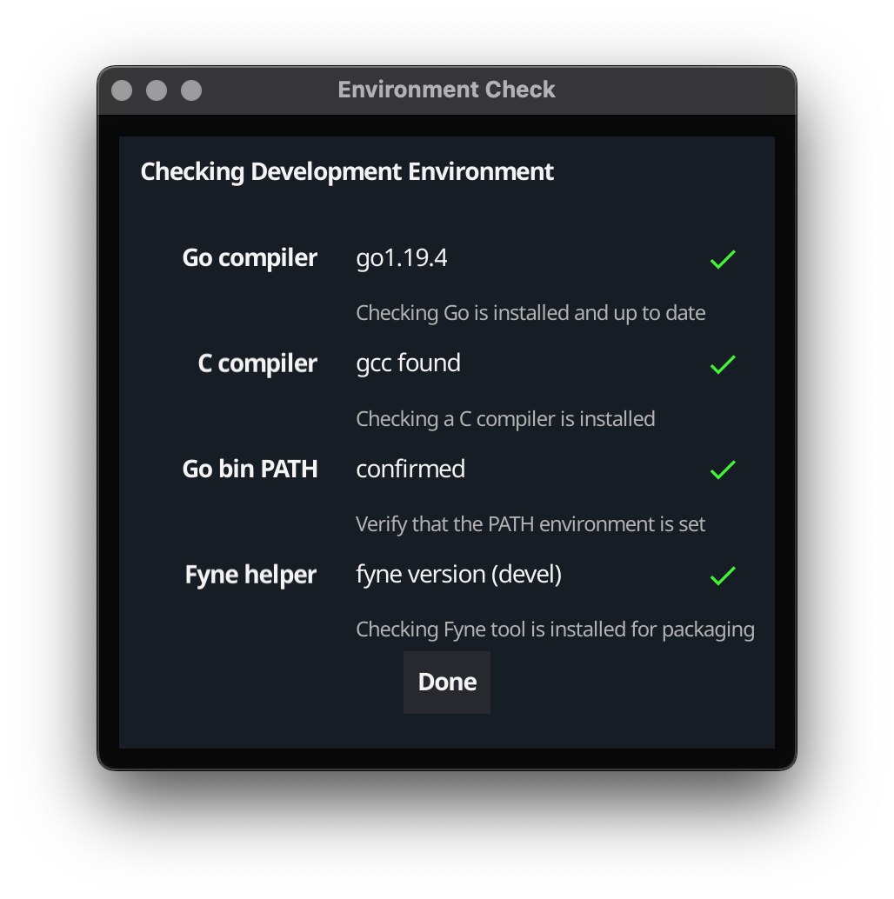

# Building Apps that work Anywhere
## Andrew Williams - 5 June 2024

---

# About Me

* Software Engineer, Author, Entrepreneur
* Founder of Fyne project
* Go developer since 2018
* CEO Fyne Labs

---

# How Go makes GUI simple

* Write once, run anywhere
* Apps that just work, do not require libraries or setup
* Native performance, without duplicating code
* Lower barrier of entry to building GUI apps
* Modern language standards and techniques
* Promote good engineering principles too

---

# Fyne Project

"

Fyne aims to be the simplest toolkit for

developing beautiful and usable

native graphical applications

for desktop, mobile and beyond

"

---

# Fyne Stats

* 6 years old
* Most popular GUI toolkit for Go
* Ranked 6th of all GUI tools by @OSSInsight
* Over 23600 GitHub stars!
* Community of >2250 on Slack, Discord, Matrix
* 15% popularity of Flutter, 20% of React Native
---
# Fyne Stats

---

# Screenshot

---

# Screenshot (dark)

---

# Prerequisites

* Install Go (>= 1.17)
* Set up gcc/clang

https://docs.fyne.io/started/

Double check with "Fyne Setup"

---

# Build our first app

$ mkdir myproject; cd myproject

$ go mod init myproject

$ go get fyne.io/fyne/v2@latest

$ vim ui.go

$ go run .

---
# Live coding...
---

# Compiling for other targets

$ go install fyne.io/fyne/v2/cmd/fyne@latest

$ fyne install

$ fyne package -os windows

$ fyne package -os android -appID com.company.myapp

--

Also see fyne-cross tool https://github.com/fyne-io/fyne-cross

---

# Let's make a Markdown editor!

* Editor widget for input
* RichText widget for output
* AdaptiveGrid container
* Update through OnChanged

---
# Live coding...
---

# Let's make a Markdown editor!

* Editor widget for input
* RichText widget for output
* AdaptiveGrid container
* Update through OnChanged

---

# Let's make a Markdown editor!

* Editor widget for input
* RichText widget for output
* AdaptiveGrid container
* Update through OnChanged

---
# Testing

$ vim ui_test.go

$ go test .

---
# Exploring further...
---
# Graphics Capabilities

---
# Basic Widgets

---
# Input Widgets

---
# Collection Widgets

---
# Containers

---
# Dialogs

---
# File input and data binding

* dialog.ShowFileOpen
* dialog.ShowFileSave
* storage package abstraction

---

# File input and data binding

* dialog.ShowFileOpen
* dialog.ShowFileSave
* storage package abstraction

--

* binding.NewString
* widget.NewLabelWithData

---
# 3rd party components too!

* Just import package and use
* Works like any widget

$ map := xWidget.NewMap()

$ cmdline := terminal.New()

https://addons.fyne.io

---

# But there is more!

* Menus, menu bar 
* Notifications
* System Tray
* Preferences and Documents
* Cloud storage integration

---

# But there is EVEN MORE!

## This entire presentation, and desktop, is Fyne!

---

# But also ONE MORE THING!

## Editing Fyne apps with a GUI builder!

---

# Learn more

* Documentation:  https://docs.fyne.io
* Videos:                  https://www.youtube.com/c/fyne-io
* Apps:                     https://apps.fyne.io
* Contribute:           https://github.com/fyne-io/fyne/
* Sponsor!               https://fyne.io/sponsor/
* **App Builder**          https://fysion.app

---

# Questions?

## @andydotxyz   /   andy@fynelabs.com

