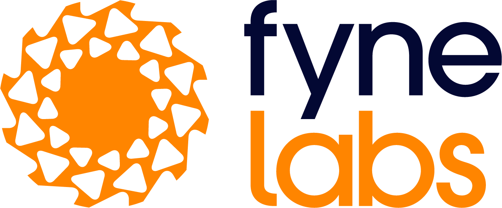
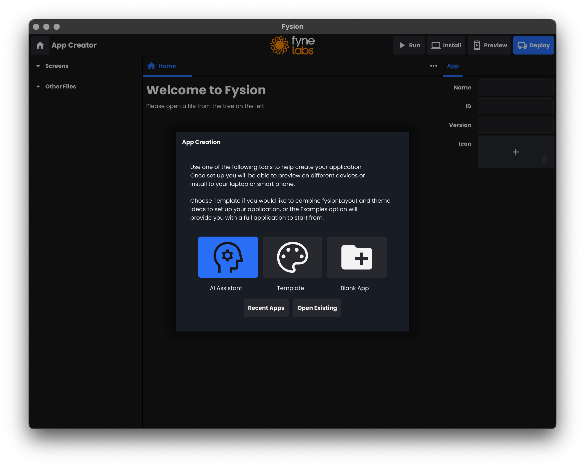
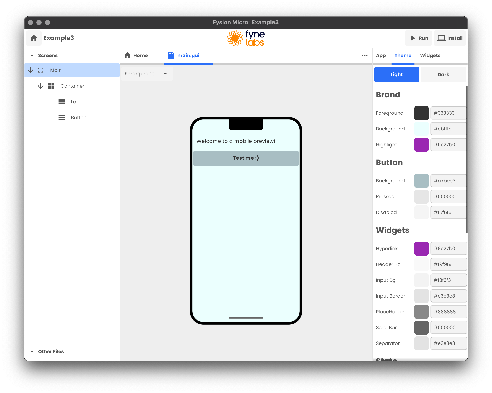
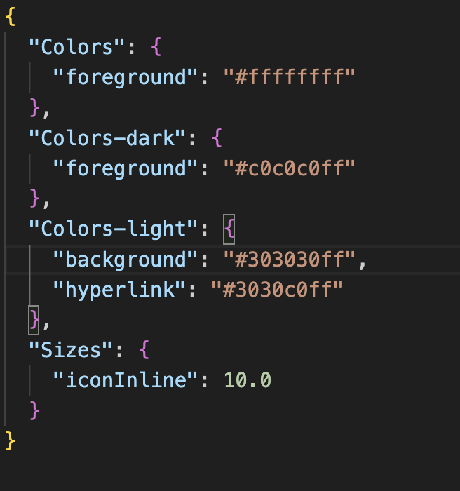
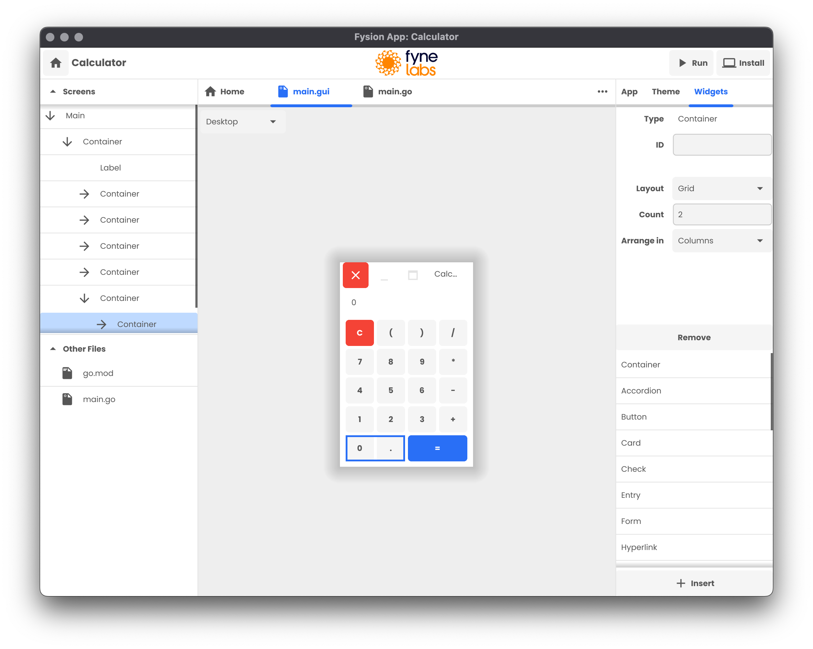
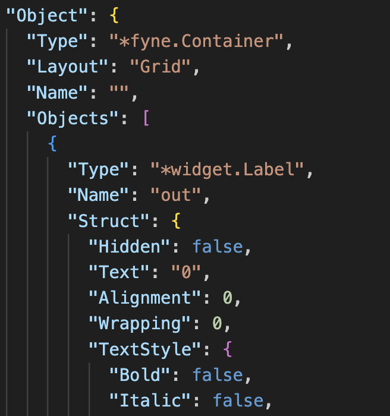
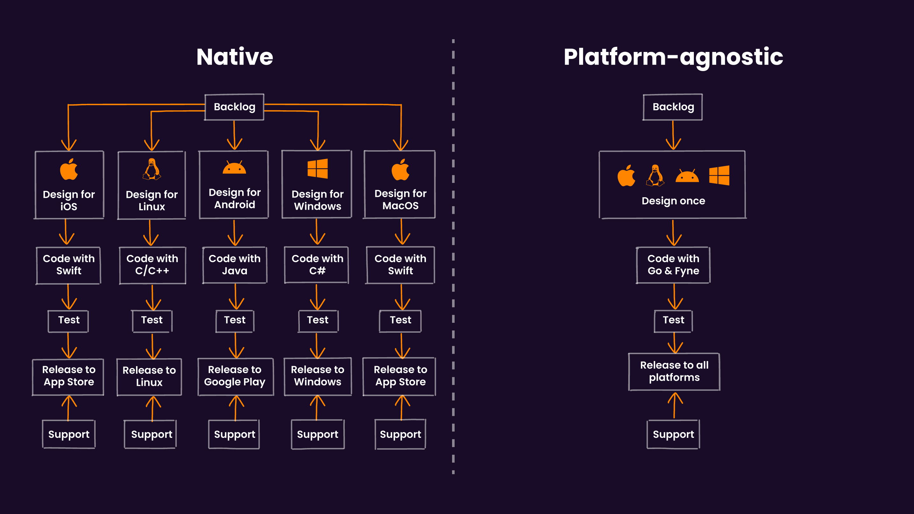
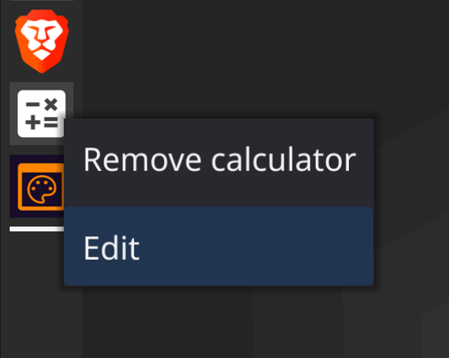

+++
theme = "fynelabs"
+++

# Low-code graphical apps with Go
## Edinburgh Gophers - 9 October 2024

---

# About Me

* Software Engineer, Entrepreneur, Author
* Enlightenment, Maven contributor
* Founder of Fyne project
* Go developer since 2018
* CEO Fyne Labs

---

# Fyne Project

"

Fyne aims to be the simplest toolkit for

developing beautiful and usable

native graphical applications

for desktop, mobile and beyond

"

---

# Fyne Stats

* 6 years old
* Most popular GUI toolkit for Go
* Ranked 6th of all GUI tools by @OSSInsight
* Over 24750 GitHub stars!
* Community of >2350 on Slack, Discord, Matrix
* 15% popularity of Flutter, 20% of React Native

---

# Build apps without coding!

---

# Fysion Aims

* Native app, runs everywhere
* Graphical editing of UI & theme
* Build on top of a real codebase
* Compile apps for all platforms
* Open source for local creation
* Business add-ons

---

# Files and source control

* Start from scratch or from templates
* Git to manage source control
* go mod init and tidy
* Metadata stored in repo
* All changes written to source code

---

# Theme handling

---

# Theme handling

* Theme data written to JSON
* Inserted with go:embed
* Loaded using theme.FromJSON
* Light/Dark colours
* Fonts/icons/sizes

---

# Widget editing

---

# Widget editing

* Serialise object tree to JSON
* Defyne lib for save/load
* github.com/fyne-io/defyne
* Code generated by GoString()
* Widget create / edit with defyne

---

# Compiling (local or cloud)

* Developer tools for local
* Install to computer
* Deploy on Geoffrey CI
* Downloads for all platforms
* fynelabs.com/geoffrey

---

# FyshOS integration

* Desktop Linux with Fyne
* Apps created with Fysion
* Edit direct from app icons
* Install your modifications
* https://fyshos.com

---

# Live Demo

---

# Learn more

* https://fysion.app
* Slack "Fysion"
* Demo video: https://youtu.be/1wMPe9pb3-o

Open Source:

* Code Videos: https://youtube.com/@fynelabs
* Source: https://github.com/fynelabs/fysion-tutorials/

---

# Questions?

## @andydotxyz   /   andy@fynelabs.com
