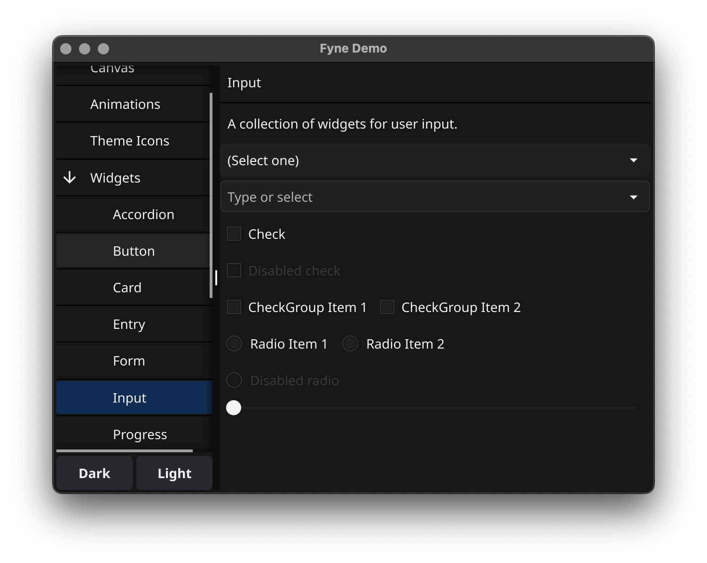

+++
theme = "fyne"
+++

# Building Apps that work Anywhere
## Andrew Williams - 26 March 2025

---

# About Me

* Software Engineer, Author, Entrepreneur
* Open source contributor
* Founder of Fyne project
* Go developer since 2018
* CEO Fyne Labs


---

# How Go makes GUI simple

* Write once, run anywhere
* Apps that just work, do not require libraries or setup
* Native performance, without duplicating code
* Lower barrier of entry to building GUI apps
* Modern language standards and techniques
* Promote good engineering principles too

---

# Fyne Project

"

Fyne aims to be the simplest toolkit for

developing beautiful and usable

native graphical applications

for desktop, mobile and beyond

"


---

# Fyne Stats

* 7 years old
* Most popular GUI toolkit for Go
* Ranked 5th of all GUI tools by @OSSInsight
* Over 26'000 GitHub stars!
* Community of >2500 on Slack, Discord, Matrix
* 15% popularity of Flutter, 20% of React Native
---
# Fyne Stats


---

# Screenshot


---

# Screenshot (dark)



---

# Prerequisites

* Install Go (>= 1.19)
* Set up gcc/clang

https://docs.fyne.io/started/

---

# Prerequisites

* Install Go (>= 1.19)
* Set up gcc/clang

https://docs.fyne.io/started/

* Double check with "Fyne Setup"


---

# Build our first app

$ mkdir myproject; cd myproject

$ go mod init myproject

$ go get fyne.io/fyne/v2@latest

$ vim hello.go

$ go run .

---
# Code: Hello World

```go
package main

import (
	"fyne.io/fyne/v2/app"
	"fyne.io/fyne/v2/widget"
)

func main() {
	a := app.New()
	w := a.NewWindow("Hello")

	w.SetContent(widget.NewLabel("Hello Bristol!"))
	w.ShowAndRun()
}
```
---

# Compiling for other targets

$ go install fyne.io/fyne/v2/cmd/fyne@latest

$ fyne install

$ fyne package -os windows

$ fyne package -os android -appID com.company.myapp

--

Also see fyne-cross tool https://github.com/fyne-io/fyne-cross

---

# Let's make a Markdown editor!

* Editor widget for input
* RichText widget for output
* AdaptiveGrid container
* Update through OnChanged


---
# Code: Markdown Editor

```go
package main

import (
	"fyne.io/fyne/v2"
	"fyne.io/fyne/v2/app"
	"fyne.io/fyne/v2/container"
	"fyne.io/fyne/v2/widget"
)

func main() {
	a := app.New()
	w := a.NewWindow("Markdown")

	input := widget.NewMultiLineEntry()
	output := widget.NewRichTextFromMarkdown("")
	content := container.NewAdaptiveGrid(2, input, output)

	input.OnChanged = output.ParseMarkdown

	w.SetContent(content)
	w.Resize(fyne.NewSize(320, 240))
	w.ShowAndRun()
}
```
---

# Let's make a Markdown editor!
## $ go run (or fyne package)


---

# Let's make a Markdown editor!
## $ fyne install -os ios


---
# Let's make a Markdown editor!
## $ fyne serve


---

# Testing

```go
package main

import (
	"testing"

	"github.com/stretchr/testify/assert"

	"fyne.io/fyne/v2/test"
	"fyne.io/fyne/v2/widget"
)

func TestText_Selected(t *testing.T) {
	e := widget.NewEntry()
	test.Type(e, "Hello")
	assert.Equal(t, "Hello", e.Text)

	test.DoubleTap(e)
	assert.Equal(t, "Hello", e.SelectedText())
	assert.Equal(t, 5, e.CursorColumn)
}
```

---
# Exploring further...
---
# Basic Widgets


---
# Input Widgets


---
# Collection Widgets


---
# Containers


---
# Dialogs


---
# File input

* dialog.ShowFileOpen
* dialog.ShowFileSave
* Use fyne.URI not path
* storage package abstraction


---

# 3rd party components too!

* Just import package and use
* Works like any widget

$ map := xWidget.NewMap()

$ cmdline := terminal.New()

https://addons.fyne.io


---

# But there is more!

* Menus, menu bar 
* Notifications
* System Tray
* Preferences and Documents
* Cloud storage integration


---

# But there is EVEN MORE!

## This entire presentation, and desktop, is Fyne!

---

# But also ONE MORE THING!

## Editing Fyne apps with a GUI builder!

---

# Learn more

* Documentation:  https://docs.fyne.io
* Videos:                  https://www.youtube.com/c/fyne-io
* Apps:                     https://apps.fyne.io
* Contribute:           https://github.com/fyne-io/fyne/
* Sponsor!               https://fyne.io/sponsor/
* **App Builder**          https://fysion.app

---

# Questions?

## @andydotxyz   /   andy@fynelabs.com

