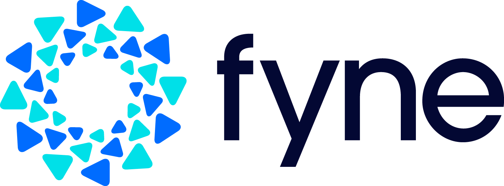
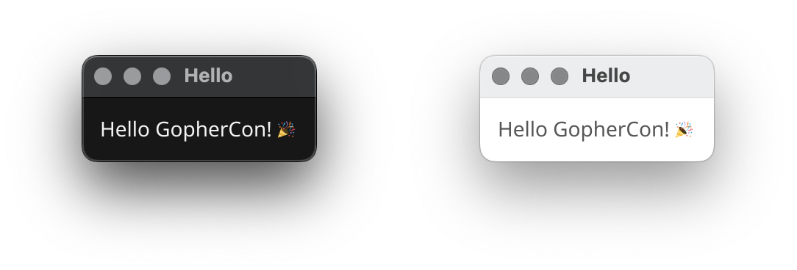

+++
theme = "gophercon"
+++

# Graphical Apps without an OS
## Single codebase apps everywhere

---

# Hello GopherCon!

* Andrew/Andy Williams
* Coder, Founder, Author
* Go/Fyne developer since 2018
* CEO Apptrix.ai
* First time here!


---

# Fyne Introduction

* Write once, run anywhere!
* No user libraries or setup
* Native apps, store support
* Easy to get started
* Promoting good engineering


---

# Fyne Hello World

```go
package main

import (
        "fyne.io/fyne/v2/app"
        "fyne.io/fyne/v2/widget"
)

func main() {
        a := app.New()
        w := a.NewWindow("Hello")

        w.SetContent(widget.NewLabel("Hello GopherCon! 🎉")) 
        w.ShowAndRun()
}
```
---

# Fyne Hello World



---

# Without an Operating System?

* TinyGo for embedded
* Tamago and GOOS=none
* Custom hardware


---

# Without an Operating System?

* TinyGo for embedded
* Tamago and GOOS=none
* Custom hardware

--

* Fyne auto-detection is limited


---

# Bridging the driver gap

* Additional custom driver API

- (Define the draw output)
- (Process events from device)

* fyne-x for common devices

```go
    a := app.New()
    app.SetDriverDetails(a,
        xEmbedded.NewUEFIDriver())
```

---

# Demo - QEMU

<!-- This app has our flag! gc25{92151a2a-2cd2-4b6b-8def-270364b0761f} -->

github.com/andydotxyz/presentations

-> 2025-08-27-GopherCon/demo

$ make qemu


---

# Demo - QEMU

<!-- This app has our flag! gc25{92151a2a-2cd2-4b6b-8def-270364b0761f} -->

github.com/andydotxyz/presentations

-> 2025-08-27-GopherCon/demo

$ make qemu

$ make tinydisplay

$ go run .


---

# Get involved!

* API design
* Device optimisation
* Slack/Discord/Matrix
* https://docs.fyne.io/started
* [Fyne Conf](https://conf.fyne.io) - https://conf.fyne.io


