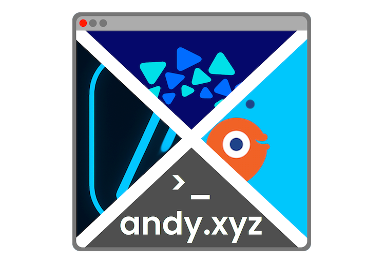
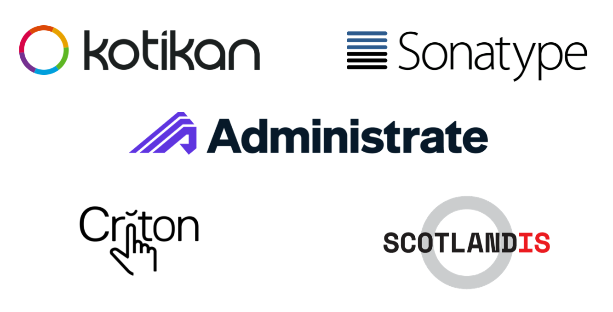
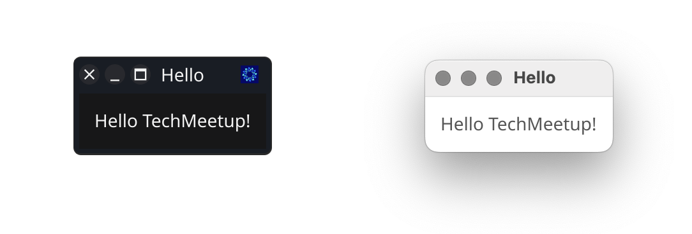
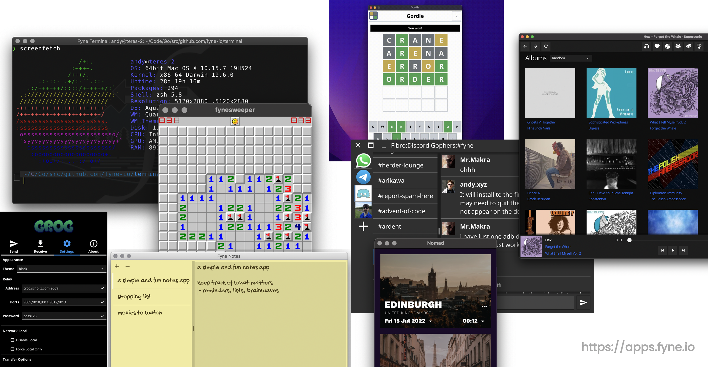
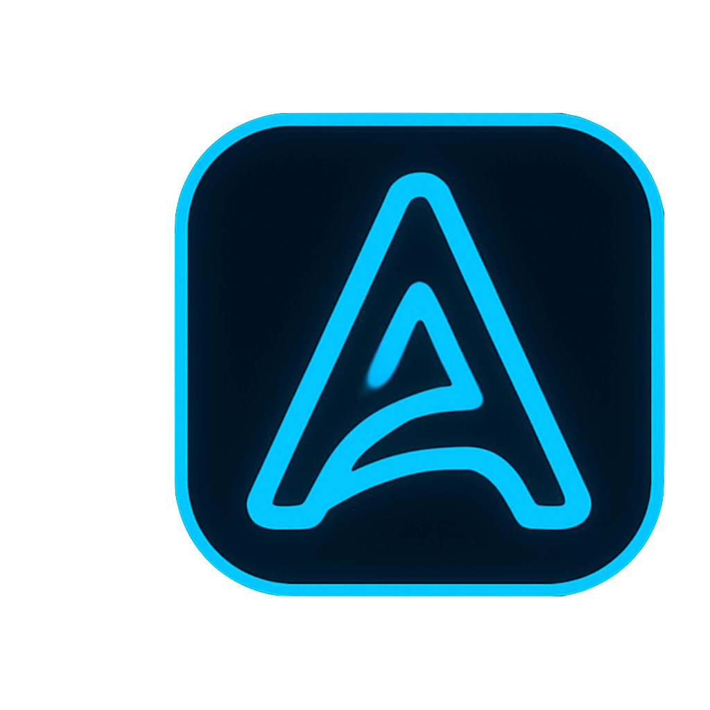
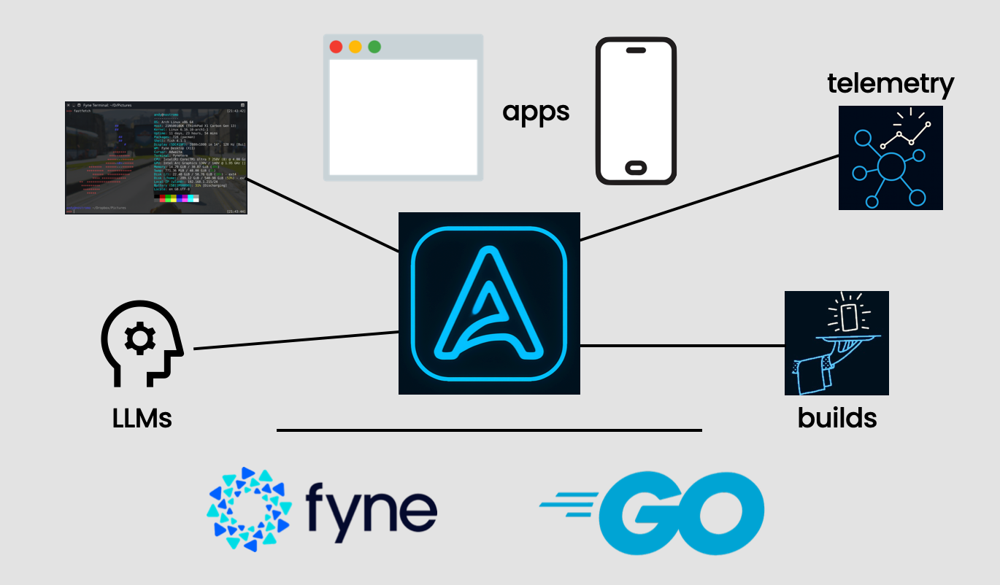
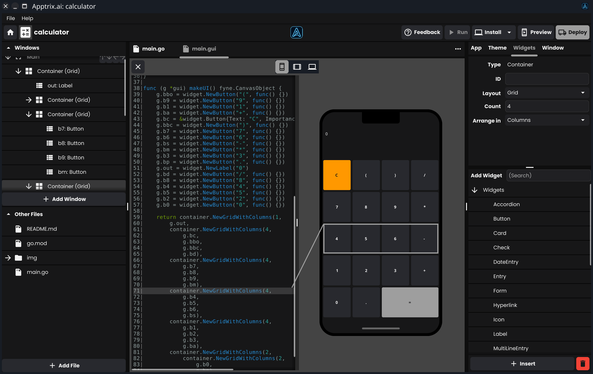
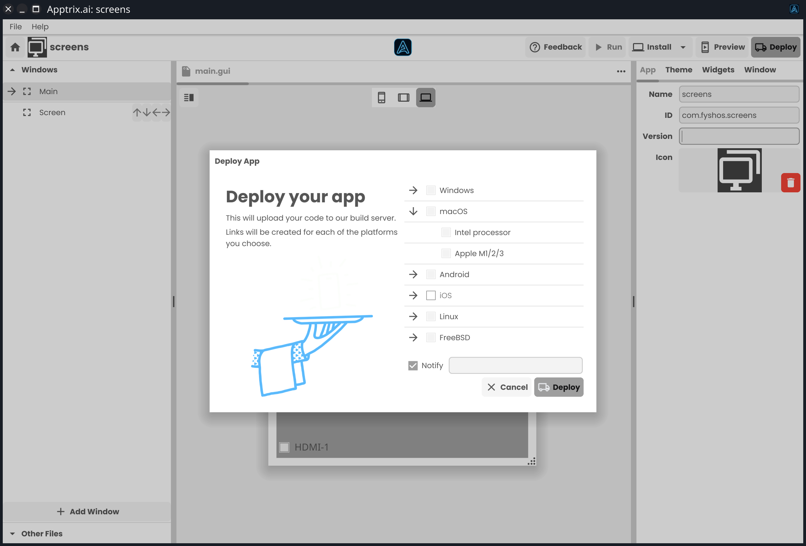
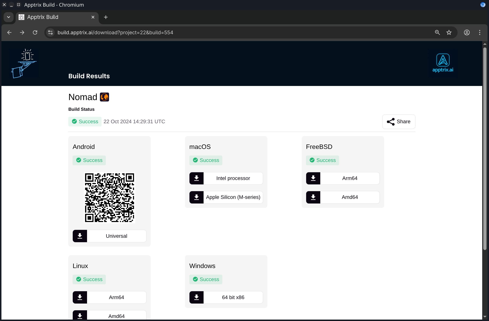
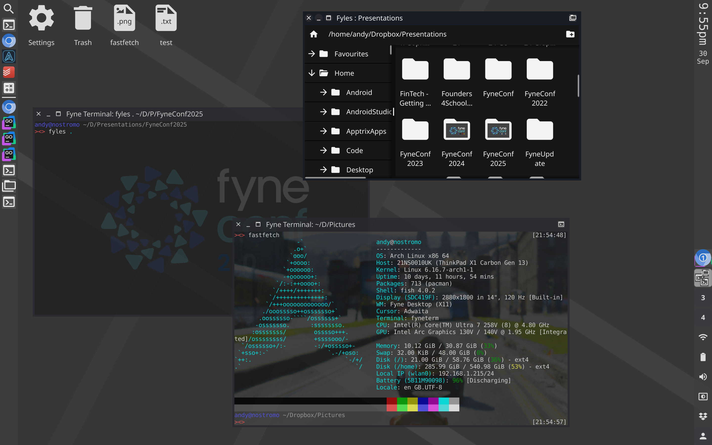

# Building Beyond the Browser
## Low-code native apps and the Community

---

# About Me

* Software Engineer, Entrepreneur, Author
* Enlightenment, Maven contributor
* Founder of Fyne project
* Go developer since 2018
* CEO Apptrix.ai



---

# Startups and Community


---

# App Development was Broken

---

# Fyne Project

* Write once, run anywhere!
* No user libraries or setup
* Native apps, store support
* Easy to get started
* Promoting good engineering


---

# Fyne Stats

* 7½ years old
* Most popular GUI toolkit for Go
* Ranked 5th of all cross-platform GUI tools by @OSSInsight
* Over 27'500 GitHub star gazers
* Community of >2500 on Slack, Discord, Matrix
* 15% popularity of Flutter, 20% of React Native

---


# Fyne Hello World

```go
package main

import (
	"fyne.io/fyne/v2/app"
	"fyne.io/fyne/v2/widget"
)

func main() {
	a := app.New()
	w := a.NewWindow("Hello")

	w.SetContent(widget.NewLabel("Hello TechMeetup!")) 
	w.ShowAndRun()
}
```
---

# Fyne Hello World



---

# Fyne Apps


---

# Reaching Beyond Developers

---

# Apptrix.ai

* Graphical drag and drop
* Single project compiles to all devices
* AI generator and assistant
* Templates and themes
* Code editor and developer tools



---

# Apptrix Architecture


---

# Apptrix Screenshot

 
---

# Build for everywhere


---

# Download everywhere


---

# Made Possible by the Community!

---

# Created with:

* Slydes slideshow app
* Fyne Terminal
* Apptrix.ai (*)
* Fyne.io toolkit
* FyneDesk desktop
* FyshOS Linux


---

# Fyne Desktop


---

# Thanks!


Please visit 🙂

*
* andy.xyz
* youtube.com/@andydotxyz
* patreon.com/cw/andydotxyz

* apptrix.ai