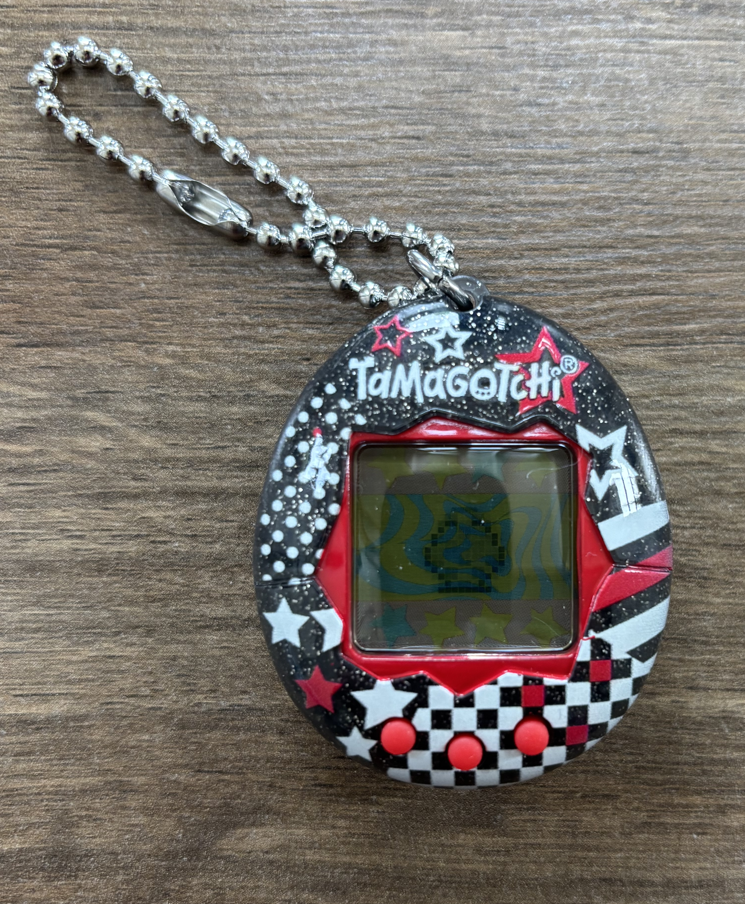
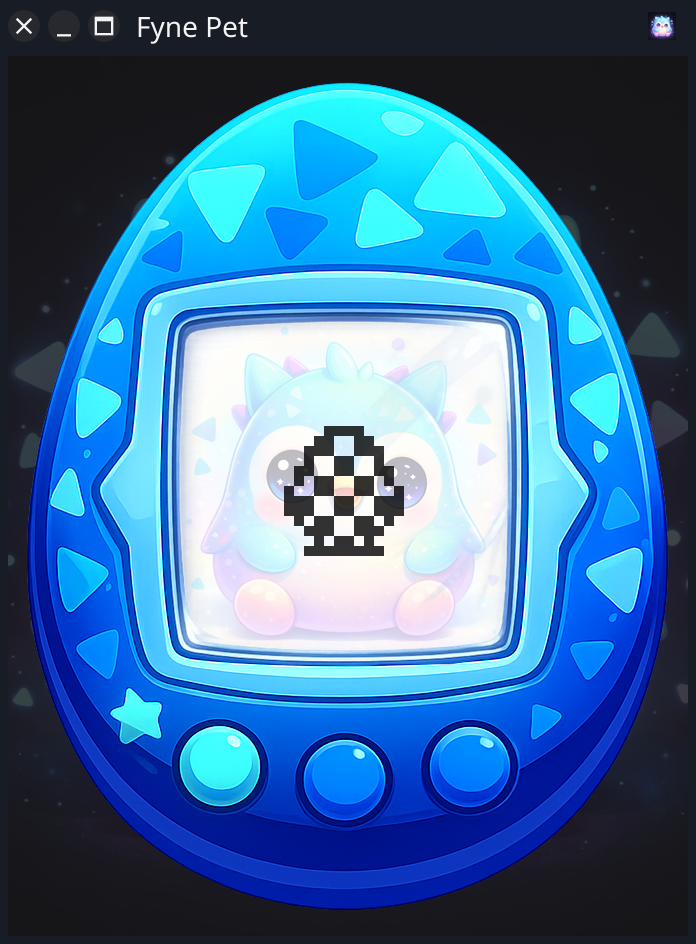
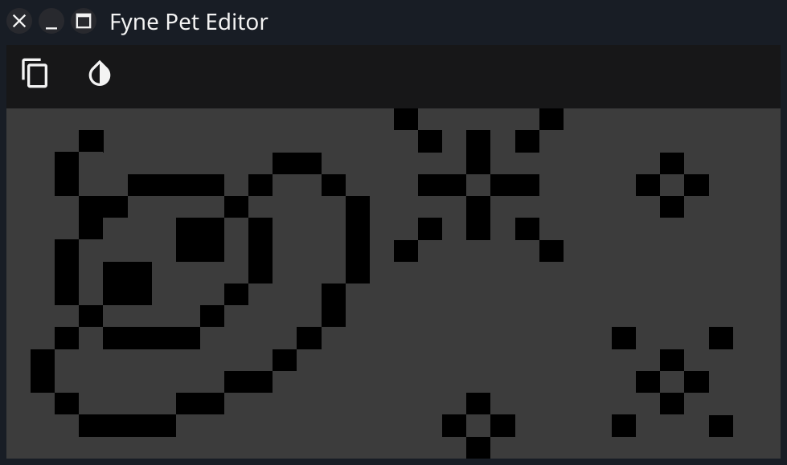
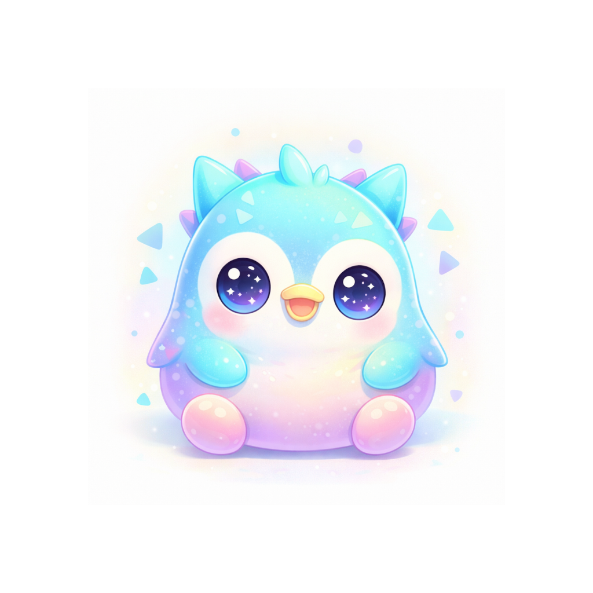

+++
theme = "pettheme"
+++

# Re-imagining the Tamagotchi
## (Coding, GenAI and some pixel manipulation)

---

# Remember this?

*
* Simple, addictive (needy!) toy
* 3 button controls
* 32x16 pixel LCD
* (gen 2 = better "game")

---

# Re-build with Go and Fyne!

* 
* Go - for productivity
* Fyne - for graphics / UI
* ChatGPT created images
* (faiface/beep for sound)

---

# Editor

*
* Simple Fyne app
* Scaled up "screen"
* Custom widget to tap pixels

---

# All platforms

*
* Desktop 
* Mobile
* Web
* Embedded!

---

# Find out more

*
* github.com/andydotxyz/fynepet
* https://andy.xyz
* @andydotxyz
* #fyne

