+++
theme = "sgtheme"
+++

# Building a Full Desktop in Go!
## (windows, desktops, compositing, modules)

---

# Another Desktop? Why?

* Linux on the Desktop!
* Go is super productive
* Better code = better experience

--

* Previously at Enlightenment
* #Fyne is my 3rd GUI toolkit

---

# Architecture

* Server (X11 / Wayland)
* Window Manager
* Compositor
* Virtual Desktops
* App icons and launcher
* Login Manager

---

# Window Manager

* 
* Capture content / events
* Draw borders
* Stacking & position
* Iconify / Maximize
* Fullscreen / borderless

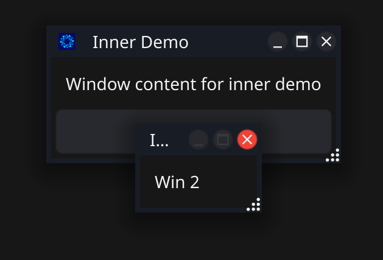

---

# Compositor

* Capture visible elements
* Background (+modules)
* Draw Windows
* Panels & overlays
* Be fast!

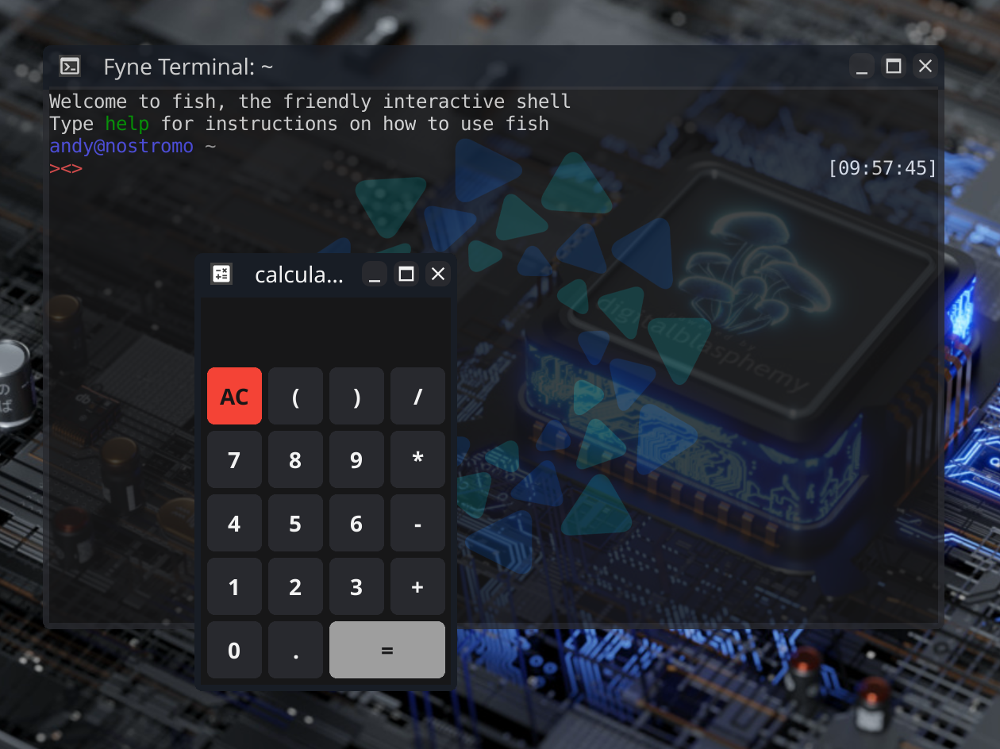

---

# Virtual Desktops

*
* Massive virtual space
* Just move the window images
* key bindings and desktop pager
* update actual windows

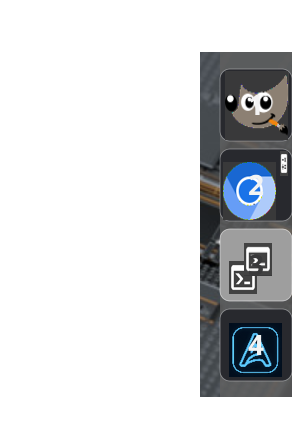

---

# App icons and launcher

*
* Find installed apps
* Parse metadata
* Load icons
* Search etc (modules)

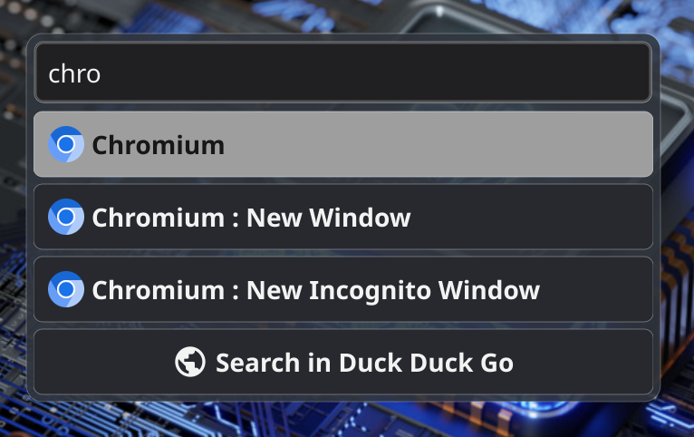

---

# ScreenSaver

* Just another Fyne app
* One window per screen
* Fullscreen
* Swallow all events
* Drop in custom visual

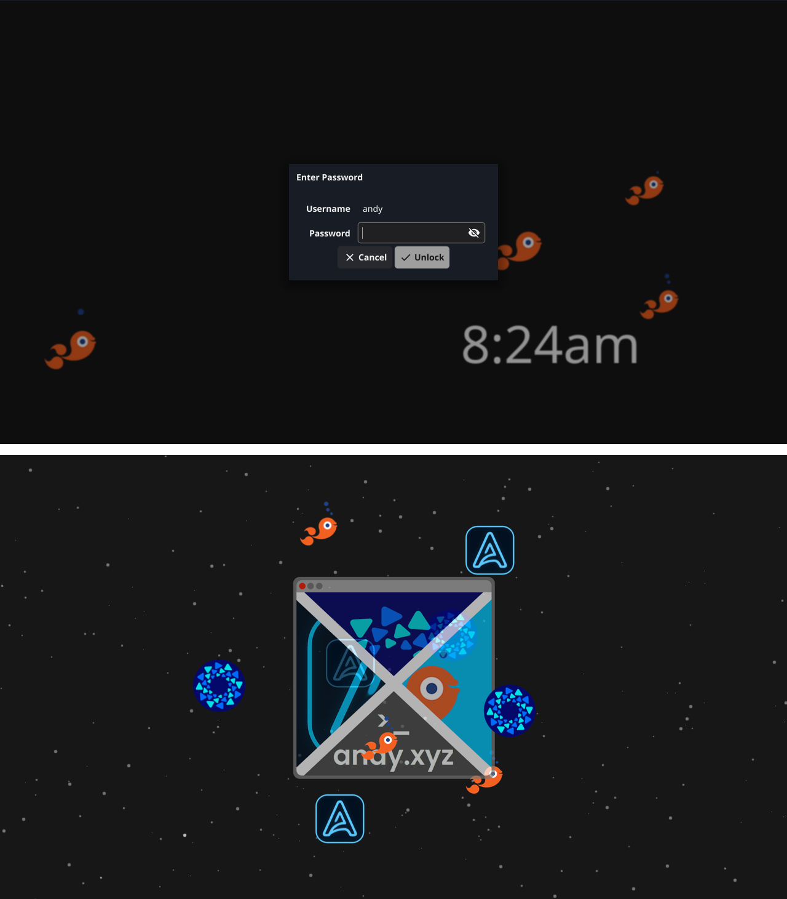

---

# Login Manager

* 
* App that launches desktop
* Handle users & logins
* Selecting desktop
* Customise per-user

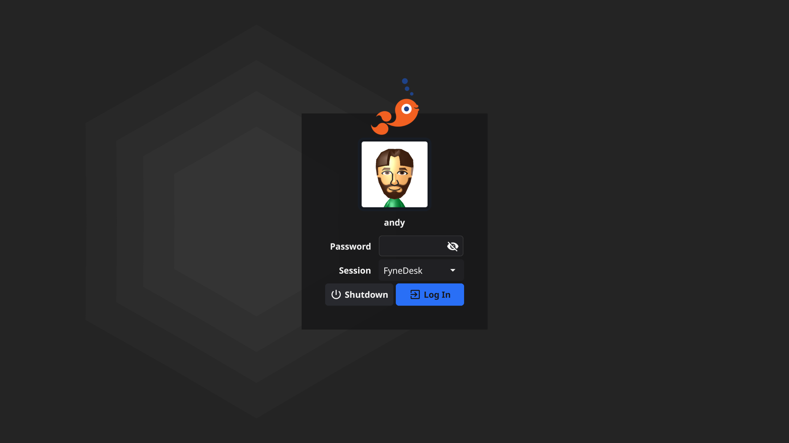

---

# Modules

* Main extensibility point:

  * Status area (system tray, wifi etc)
  * Screen area (Fyles, backgrounds)
  * Launcher (Conversion, web search etc)
  * Keyboard (brightness, airplane etc)

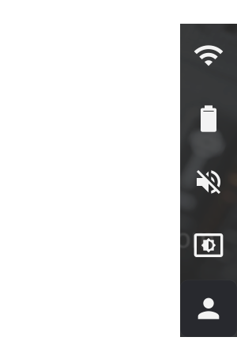

---

# All Together!

  * tyde / backgrounds
  * appie
  * dryvers / screens
  * fancyfs / fyles
  * fyshsaver
  * fin

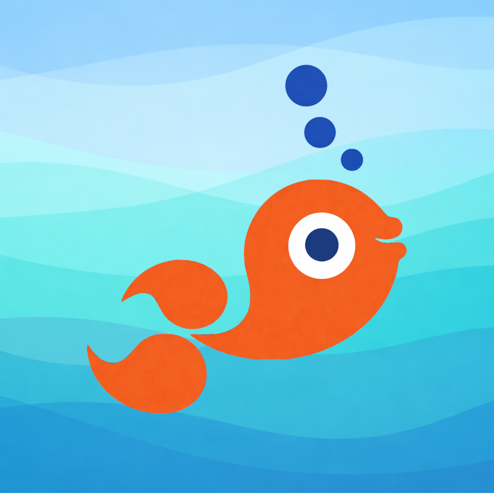

---

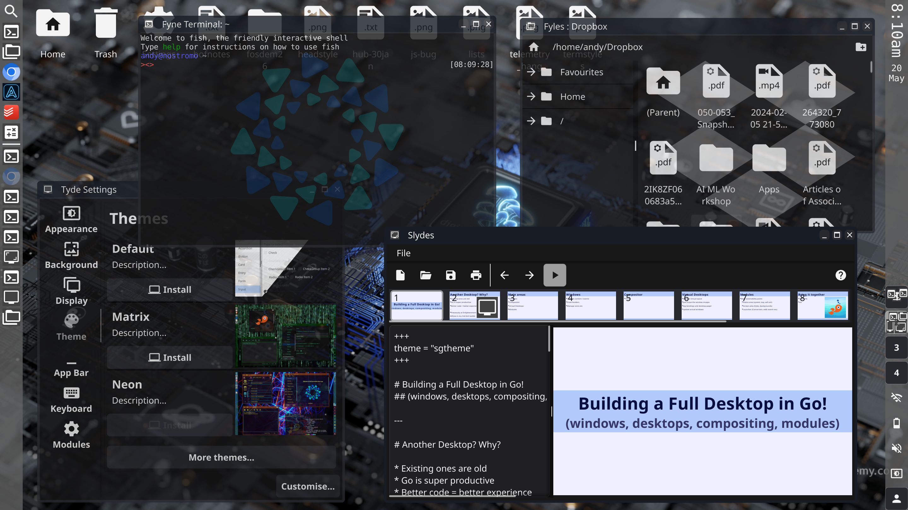

---

# Bonus: WYSIWYG App Editing

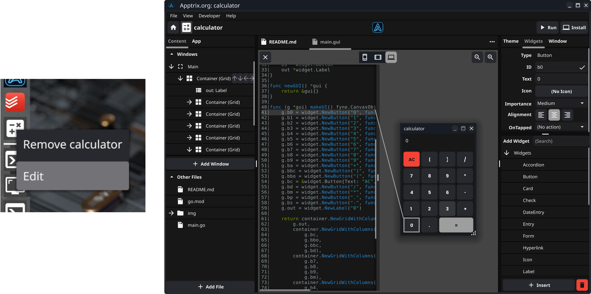

---

# Find out more

* https://fyshos.com
* github.com/FyshOS/tyde
* #fyne
* @andydotxyz
* https://andy.xyz
* https://apptrix.ai

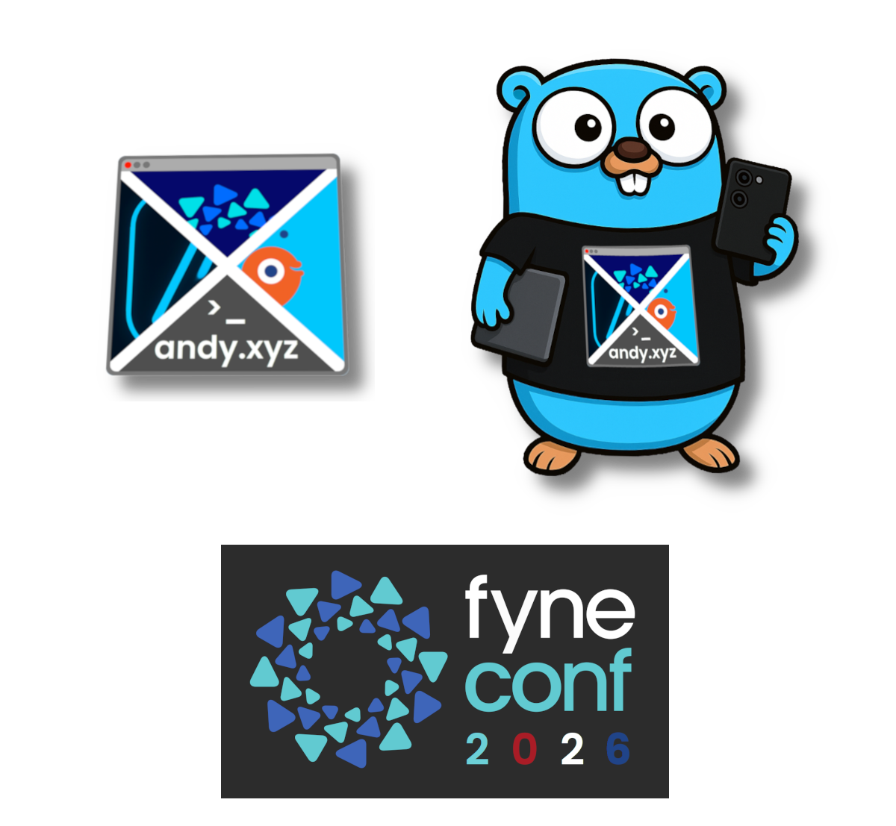
